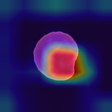
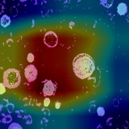

# VariLiteFormer — A Region-Adaptive Lightweight Transformer for Leukemia Cell Classification

[](https://python.org)
[](https://pytorch.org)
[](LICENSE)
[](.)

> **Sowjanya Madireddy¹ · Dr. Raghu Indrakanti²**
> ¹² Department of Computer Science and Engineering, [Your University], India

---

## Overview

VariLiteFormer is a hybrid deep learning framework for automated detection and
classification of Acute Lymphoblastic Leukemia (ALL) from peripheral blood smear
and microscopy images.

The core idea: instead of using a full Vision Transformer (ViT) with 196 patch
tokens and O(N²) attention cost, we let ResNet extract features first and pass
**a single global token** into a lightweight Transformer encoder. This reduces
attention complexity from O(N²) to **O(1)** with respect to spatial resolution —
making the model CPU-deployable on standard hospital workstations.

---

## Key Results

| Dataset | Backbone | Accuracy | AUC | F1-Score | Recall |
|---------|----------|----------|-----|----------|--------|
| ALL-IDB | ResNet-18 | **98.12%** | **0.999** | 0.990 | 0.993 |
| C-NMC 2019 | ResNet-50 | **97.49%** | **0.983** | 0.962 | 0.984 |

- **+0.32% accuracy** and **+0.9 AUC points** over prior best on ALL-IDB
- **+0.69% accuracy** over nearest competitor on C-NMC 2019
- **7.7× fewer parameters** than ViT-Base (11.2M vs 86M)
- **CPU deployable** — no GPU required for inference

---

## Architecture

```
Input Image (224×224)
       ↓
Otsu Nucleus Segmentation          ← Region-adaptive preprocessing
       ↓
ResNet-18 / ResNet-50 + GAP        ← Local morphological features  (B, D)
       ↓
unsqueeze → Single global token    ← O(1) tokenisation             (B, 1, D)
       ↓
Transformer Encoder (1 layer, 4 heads)  ← Global contextual reasoning
       ↓
Linear(D→256) → BN → ReLU → Dropout(0.4) → Linear(256→2) → Softmax
       ↓
Prediction + GradCAM heatmap
```


---

## Sample Results — GradCAM Visualisations

The model consistently attends to the **enlarged, irregularly shaped nucleus**
of ALL blast cells — exactly what haematologists look for.

| C-NMC Sample 1 | C-NMC Sample 2 | ALL-IDB Sample 1 | ALL-IDB Sample 2 |
|:-:|:-:|:-:|:-:|
|  |  |  |  |
| ResNet-50 · C-NMC | ResNet-50 · C-NMC | ResNet-18 · ALL-IDB | ResNet-18 · ALL-IDB |

Red-orange = high model attention · Blue-purple = low activation

---

## Input Image Samples

| Dataset | ALL Blast Cell | Normal Cell |
|---------|:-:|:-:|
| C-NMC 2019 |  |  |
| ALL-IDB |  |  |

---

## Project Structure

```
lukemina/
├── configs/
│   └── config.py               # All hyperparameters and paths
├── segmentation/
│   └── nucleus_segmenter.py    # Otsu-based nucleus segmentation
├── variliteformer/
│   ├── datasets/
│   │   └── leukemia_dataset.py # Dataset loader with segmentation
│   └── models/
│       └── resnet_transformer.py  # VariLiteFormer architecture
├── assets/
│   ├── architecture.png        # Pipeline diagram
│   ├── samples/                # Input image examples
│   └── gradcam/                # GradCAM output examples
├── train.py                    # Training script
├── evaluate.py                 # Evaluation + metrics
├── gradcam.py                  # GradCAM visualisation
└── graph.py                    # Training curve plots
```

---

## Installation

```bash
# Clone the repository
git clone https://github.com/your-username/variliteformer-leukemia.git
cd variliteformer-leukemia

# Create virtual environment
python -m venv .venv
.venv\Scripts\activate       # Windows
# source .venv/bin/activate  # Linux/Mac

# Install dependencies
pip install torch torchvision torchaudio --index-url https://download.pytorch.org/whl/cu118
pip install opencv-python scikit-learn matplotlib tqdm
```

---

## Datasets

Download the datasets and place them in the `dataset/` folder:

| Dataset | Source | Classes |
|---------|--------|---------|
| **C-NMC 2019** | [Kaggle — C-NMC Leukemia](https://www.kaggle.com/datasets/avk256/cnmc-leukemia) | ALL blast / Normal HEM |
| **ALL-IDB** | [IEEE Dataport — ALL-IDB](https://homes.di.unimi.it/scotti/all/) | Benign / Early / Pre / Pro |

Expected folder structure after download:
```
dataset/
├── ALL_IDB/
│   └── segmented/
│       ├── benign/
│       ├── early/
│       ├── pre/
│       └── pro/
└── C-NMC 2019 (PKG)/
    ├── train/
    │   ├── all/
    │   └── hem/
    └── val/
        ├── all/
        └── hem/
```

---

## Configuration

Edit `configs/config.py` before running:

```python
DATASET_PATH = "dataset/ALL_IDB/segmented"   # or C-NMC path
MODEL_BACKBONE = "resnet18"                   # "resnet18" or "resnet50"
IMG_SIZE = 224
BATCH_SIZE = 32
NUM_EPOCHS = 50
LR = 1e-4
NUM_CLASSES = 2
```

---

## Training

```bash
# Train VariLiteFormer
python train.py

# Checkpoint saved automatically to:
# checkpoints/best_resnet18.pth  (or best_resnet50.pth)
```

Training runs for up to 50 epochs with:
- AdamW optimizer (lr=1e-4, weight_decay=1e-4)
- Cosine Annealing learning rate schedule
- Weighted cross-entropy loss (class weights [1.0, 1.4])
- Label smoothing (ε=0.1)
- Gradient clipping (norm=1.0)
- AMP mixed-precision training

---

## Evaluation

```bash
# Generate classification report, confusion matrix, ROC and PR curves
python evaluate.py

# Results saved to: outputs/graphs/
```

---

## GradCAM Visualisation

```bash
# Generate GradCAM heatmap for a single image
python gradcam.py path/to/your/image.png

# Output saved to: outputs/gradcam/gradcam_result.png
```

---

## Complexity Comparison

| Model | Attention Cost | Memory | Parameters | GPU Required |
|-------|---------------|--------|------------|-------------|
| CNN (ResNet-18) | O(HW·D) | O(HW·D) | 11.2M | No |
| ViT-Base | O(N²·D) = O(38,416·D) | O(N²) | 86M | Yes |
| Hybrid CNN-ViT | O(N²·D) | O(N²) | ~86M+ | Yes |
| **VariLiteFormer (ours)** | **O(D)** | **O(D)** | **11.2M** | **No** |

N=196 patches for a 224×224 image with 16×16 patch size → 196²=38,416× more attention pairs in full ViT vs VariLiteFormer.

---

## Citation

If you use this work, please cite:

```bibtex
@article{madireddy2025variliteformer,
  title   = {A Region-Adaptive Lightweight Transformer for Computationally
             Efficient Leukemia Cell Classification},
  author  = {Madireddy, Sowjanya and Indrakanti, Raghu},
  journal = {[Target Journal]},
  year    = {2025}
}
```

---

## License

This project is licensed under the MIT License — see the [LICENSE](LICENSE) file for details.

---

## Acknowledgements

- C-NMC 2019 dataset: Liu et al., ISBI 2019
- ALL-IDB dataset: Labati et al., IEEE ICIP 2011
- ResNet architecture: He et al., IEEE CVPR 2016
- GradCAM: Selvaraju et al., IEEE ICCV 2017

---

*This work is part of PhD research at [Your University]. Paper 2 (multi-objective
hyperparameter optimisation of VariLiteFormer) is currently in progress.*